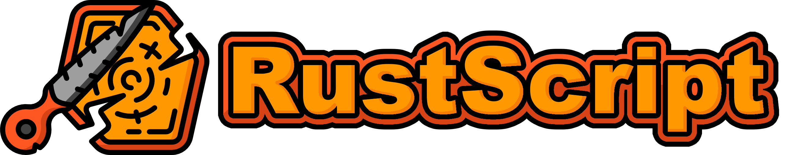

<div>
    <h1>
        
    </h1>
    <p>
        RustScript is a scripting language with as much relation to Rust as JavaScript has to Java.
    </p>
</div>


 <!-- ALL-CONTRIBUTORS-BADGE:START - Do not remove or modify this section -->
[](#contributors-)
<!-- ALL-CONTRIBUTORS-BADGE:END -->

<br>

> ## 📥 Install
>
> [Download](https://github.com/WilliamRagstad/RustScript/releases/latest/download/rsc.zip) the latest version of the RustScript CLI tool, or [view all releases](https://github.com/WilliamRagstad/RustScript/releases).

<br>

## Usage

### 🔌Run

> Don't forget to download the latest version from above, and install the RustScript toolchain as described in the `README.md` installation instructions file that comes pre-packaged.

Run the `rsc` command with either the `--help` or `-h` option to show the user manual or help page for the CLI tool.
Execute scripts using the following command.

```shell
rsc hello.rs world.rs
```

Or if you haven't installed the native CLI binaries, run the `rsc.jar` file using:

```shell
java -jar rsc.jar hello.rs
```

### 🔨 Build

If you want to build RustScript on your own. Install the **WiX Toolset** (`dist/tools/wix311.exe`) and run the `build.bat` script from the root directory to build the `Cli.java` class into the standalone executables to `dist/bin/`.

You can also simply compile the class files by running the `compile.bat` script from the root directory, and run any module using `java Repl` for example.


## Documentation

Learn more about the RustScript language by visiting the links below! A good tip is to download the `rsc` CLI tool and start playing around with the examples yourself!

* #### [Code examples](doc/EXAMPLES.md)

* #### [Project euler solutions](doc/PROJECT_EULER.md)


## REPL

Start the interactive REPL command tool by running `rsc -r`  or `rsc --repl`. Once started, a little `> ` will appear prompting for an expression to evaluate. You can run anything here as long as it is kept on one line. Expression can be easily separated by semi-colons `;`, and their result will be displayed belowed.

There are also a set of custom commands used when moving around in the local file system. This is done to make it easier to navigate to files that you want to import variables from into your session.

### Commands

| Command | Arguments | Description                                     |
| ------- | --------- | ----------------------------------------------- |
| pwd     |           | Display the current working directory           |
| ls      |           | List all files in the current working directory |
| cd      | [path]    | Change current working directory                |

  

## Community
The RustScript language is developed by a group of volunteers. To further support the project, we welcome any and all **feedback**, **contributions** and **engagement**!


* #### Join our discord server: https://discord.gg/qCc35JFCzZ
* #### Contrubute code or documentation: https://github.com/WilliamRagstad/RustScript
* #### Sponsor the project: https://github.com/sponsors/WilliamRagstad
* #### Donate: https://www.paypal.com/paypalme/williamragstad


## ✨ Contributors

Thanks goes to these wonderful people ([emoji key](https://allcontributors.org/docs/en/emoji-key)):

<!-- ALL-CONTRIBUTORS-LIST:START - Do not remove or modify this section -->
<!-- prettier-ignore-start -->
<!-- markdownlint-disable -->

<table>
  <tr>
    <td align="center"><a href="https://www.williamragstad.com/"><br /><sub><b>William Rågstad</b></sub></a><br /><a href="#maintenance-WilliamRagstad" title="Maintenance">🚧</a> <a href="https://github.com/WilliamRagstad/RustScript/commits?author=WilliamRagstad" title="Tests">⚠️</a> <a href="https://github.com/WilliamRagstad/RustScript/commits?author=WilliamRagstad" title="Code">💻</a> <a href="#design-WilliamRagstad" title="Design">🎨</a></td>
    <td align="center"><a href="https://mikail-khan.com"><br /><sub><b>Mikail Khan</b></sub></a><br /><a href="https://github.com/WilliamRagstad/RustScript/commits?author=mkhan45" title="Documentation">📖</a> <a href="https://github.com/WilliamRagstad/RustScript/commits?author=mkhan45" title="Tests">⚠️</a> <a href="https://github.com/WilliamRagstad/RustScript/commits?author=mkhan45" title="Code">💻</a></td>
  </tr>
</table>

<!-- markdownlint-restore -->
<!-- prettier-ignore-end -->

<!-- ALL-CONTRIBUTORS-LIST:END -->

This project follows the [all-contributors](https://github.com/all-contributors/all-contributors) specification. Contributions of any kind welcome!

[](https://sourcerer.io/fame/WilliamRagstad/WilliamRagstad/RustScript/links/0)[](https://sourcerer.io/fame/WilliamRagstad/WilliamRagstad/RustScript/links/1)[](https://sourcerer.io/fame/WilliamRagstad/WilliamRagstad/RustScript/links/2)[](https://sourcerer.io/fame/WilliamRagstad/WilliamRagstad/RustScript/links/3)[](https://sourcerer.io/fame/WilliamRagstad/WilliamRagstad/RustScript/links/4)[](https://sourcerer.io/fame/WilliamRagstad/WilliamRagstad/RustScript/links/5)[](https://sourcerer.io/fame/WilliamRagstad/WilliamRagstad/RustScript/links/6)[](https://sourcerer.io/fame/WilliamRagstad/WilliamRagstad/RustScript/links/7)


## Logo Credits

The logo is a modified image by [Smashicons](https://smashicons.com/) from [Flaticon](https://www.flaticon.com). The original images can be found [here](https://www.flaticon.com/search?word=rusty&style=all&order_by=4&type=icon) or in the [assets](https://github.com/WilliamRagstad/RustScript/tree/main/assets) folder.


## License

RustScript is free and open source! All code in this repository is dual-licensed under either:

* MIT License ([LICENSE-MIT](docs/LICENSE-MIT) or [http://opensource.org/licenses/MIT](http://opensource.org/licenses/MIT))
* Apache License, Version 2.0 ([LICENSE-APACHE](docs/LICENSE-APACHE) or [http://www.apache.org/licenses/LICENSE-2.0](http://www.apache.org/licenses/LICENSE-2.0))

at your option. This means you can select the license you prefer! This dual-licensing approach is the de-facto standard in the Rust ecosystem and there are very good reasons to include both. Read more about Rusts license model [here](https://rust-lang.github.io/api-guidelines/necessities.html#necessities).

## Contribution

Unless you explicitly state otherwise, any contribution intentionally submitted for inclusion in the work by you, as defined in the Apache-2.0 license, shall be dual licensed as above, without any additional terms or conditions.

You can join our community [discord](https://discord.gg/qCc35JFCzZ) server and chat with the dev team!
All feedback and support is greatly appreciated!
